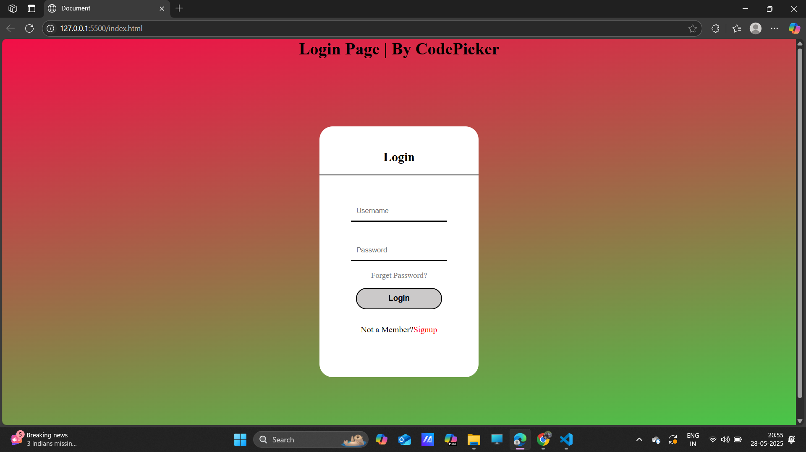

# 🔐 Login Page

This login page is made according to a given template using **HTML** and **CSS only**. It features a modern and clean layout for user login, including fields for username and password, a "Forget Password?" link, and a prompt for new users to sign up.

---

## 📷 Screenshot

> 💡 *Screenshot of the login page output.*

---

## 🚀 Features

- Responsive and clean design
- Username and password input fields
- "Forget Password?" link
- Sign-up option for new users
- Fully styled with external CSS (`style.css`)

---

## 🛠️ Tech Stack

- **HTML5**
- **CSS3**

---

## 📁 Folder Structure

